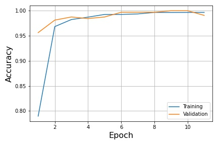
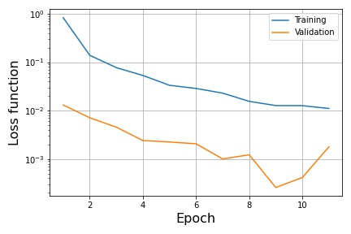

# CNN-Traffic-sign-image-recognition
A Convolutional Neural Network solution for identifying traffic signs in images.

### Instructions

1. Download the traffic sign training and testing datasets from [here](http://benchmark.ini.rub.de/?section=gtsrb&subsection=dataset#Overview).
2. Run file `traffic_sign_recognition.py` to process the data, train the CNN model and export the recognition results from the test data. The file consists of 3 routines. 

* `process_images(image_length)` processes both training and test sets for working in tensorflow, with `image_length` being the image resizing dimension to have as input for the CNN (default is 30). The processed images are stored in `Traffic_signs_train.npz` and `Traffic_signs_test.npz` for training and test images respectively.
* `train_model(path,split,visualise)` trains the CNN model with a cross validation split of the training dataset defined by `split` (default is 0.1) and stores it in folder `path`. `visualise` is a boolean (default is False) indicating whether to export graphs of the accuracy and loss function values during training.
* `test_model(path)` tries the model stored in `path` on the test data (stored in `Traffic_signs_test.npz`) and outputs the recognised signs in `Results.csv`.

3. Inspect the results. Enabling visualisation in `train_model()` yields results like the following:
  

File `signnames.csv` includes the correspondence of numerical class IDs to actual sign descriptions and is used to generate `Results.csv`.

**Comment:**

The test data are not currently labeled and thus evaluating the accuracy of the model on the test set is done by manual inspection of `Results.csv`. Despite that, the model appears extremely accurate on the training set, achieving an accuracy of about 99.6% as seen from the figure above, in about 10 epochs (early stopping is used to avoid overfitting).
